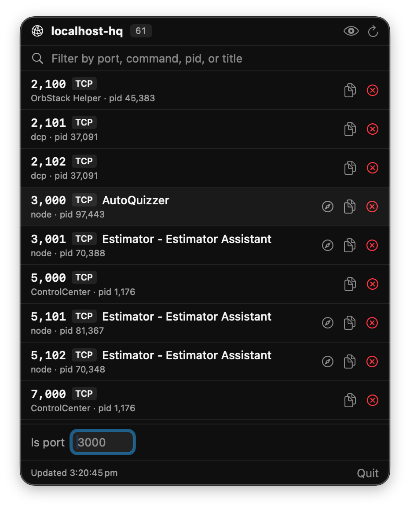

# localhost-hq

A tiny macOS menu bar app that tells you what's running on localhost — so you stop forgetting which dev server is on which port and stop hitting port conflicts.



## Why

If you juggle a dozen dev servers at once (a Next.js app, a .NET API, a Rails service, a couple of microservices, some random prototype on `:5173`), you already know the pain:

- Which app is on port 3000 right now?
- Is 5432 taken by the old stack I forgot to kill?
- What is this random port Rider opened?

`localhost-hq` lives in your menu bar and answers those questions at a glance.

## Features

- **Live list** of TCP listeners with port, protocol, process name, and PID. Auto-refreshes every 3s.
- **HTTP title scrape** — each port gets a quick `GET /` with a 1.5s timeout. If it's serving HTML, the page `<title>` is shown next to the port. That's how `3000` reads as *AutoQuizzer* and `5101` as *Estimator – Estimator Assistant*.
- **Noise filter** with sane defaults — hides JetBrains IDEs, Adobe apps, Docker/OrbStack internals, Dropbox, Slack/Teams/Zoom, browser helpers, macOS daemons. Toggle it off with the eye icon when you want to see everything.
- **Smart override** — anything in the noise list that *does* respond with an HTTP title is still shown. A dev server running inside Rider won't hide itself.
- **Settings pane (⌘,)** — add, remove, or reset the hide-patterns. Matching is lowercased substring, so `rider` hides `Rider.Backend` and `Rider.Backend.Worker` alike.
- **One-click hide** — per-row eye-slash button adds that exact command to your hidden patterns without opening Settings.
- **Conflict badge** when two processes bind the same port.
- **"Is port N free?"** — type a port, see instantly whether anything is on it (and what).
- **Open in browser** button for any port we got a title from.
- **Copy port** and **kill process** (TERM or KILL with confirmation).
- **Search** by port, command, pid, or scraped title.

## Requirements

- macOS 14+
- Xcode command line tools (for `swift build`)

No privileged entitlements, no sudo. Everything comes from `lsof` on your own processes and plain HTTP requests to `localhost`.

## Run

```sh
git clone https://github.com/bradystroud/localhost-hq
cd localhost-hq
swift run
```

Or open `Package.swift` in Xcode and hit run. The app hides its dock icon at launch via `NSApplication.activationPolicy = .accessory` — look for the `network` SF Symbol in the menu bar.

## How it works

- **Scanning:** shells out to `lsof -iTCP -sTCP:LISTEN -P -n +c 0 -F pcPn` and parses the field-tagged output. `+c 0` disables command-name truncation so `Rider.Backend.Worker` reads as its full name.
- **Title probing:** each new `port+pid` combination gets one `GET http://localhost:PORT/` with a 1.5s timeout via an ephemeral `URLSession`. Results are cached and cleared when that process stops listening.
- **Filtering:** `HiddenPatternsStore` keeps your hide-patterns in `UserDefaults`, seeded from `PortFilter.defaultNoisePatterns` on first launch.
- **UI:** pure SwiftUI `MenuBarExtra` with `.menuBarExtraStyle(.window)`. No Xcode project committed — the repo builds with plain SPM.

## Layout

```
Sources/LocalhostHQ/
├── LocalhostHQApp.swift       @main entry, wires up MenuBarExtra + Settings scene
├── MenuBarView.swift          dropdown UI, search, port rows
├── SettingsView.swift         hide-pattern editor (⌘,)
├── PortScanner.swift          lsof shell-out + parser, 3s refresh timer
├── TitleProber.swift          HTTP GET + <title> extraction + caching
├── PortFilter.swift           built-in default hide-pattern list
├── HiddenPatternsStore.swift  persistent hide-pattern store
└── Port.swift                 ListeningPort model
```

## Roadmap

- Persistent labels per port ("3000 → my-next-app")
- Auto-detect the project directory from the process `cwd`
- Launch at login via `SMAppService`
- A proper `.app` bundle with icon + notarization
- UDP listeners
- Menu-bar icon badge when a known port opens/closes

## License

MIT. Do whatever you want.
